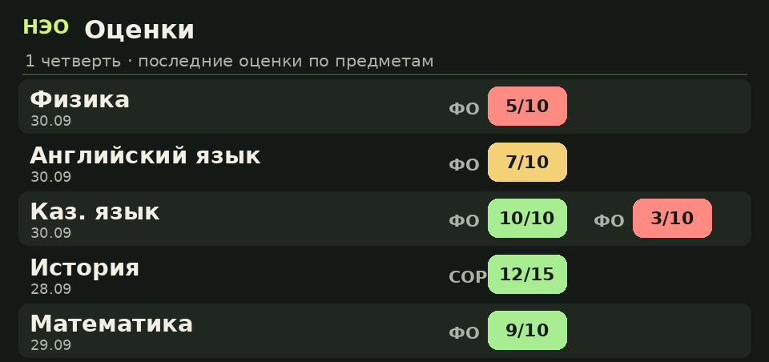

# НЭО — BilimClass в Telegram

Личный школьный помощник для ученика: дневник открывается за пару нажатий, а важные изменения приходят сами. НЭО — **неофициальный** клиент BilimClass, созданный на основе уже работающего Python-парсера. Интерфейс и уведомления рассчитаны на личный чат, без публикации оценок в группах. Главный экран показывает сегодняшний день; недельный обзор открывает любой день, а внутри него отдельные вкладки уроков, звонков и ДЗ.

**Быстрый запуск:** `./manage.sh` откроет интерактивное меню настройки и управления; `./start.sh` запустит бота напрямую.

Перед первым входом НЭО предлагает два оформления с примерами: **Табло** (рисованные карточки разделов, тёмный фон и лаймовый акцент) и **Компактный** (текст и кнопки). Сменить режим и выключить анимацию можно в **Настройки → Оформление**. При `/start` бот приветствует по имени Telegram. Подробные задания остаются доступными текстом, даже если не помещаются в подпись картинки.



## Что умеет

| Дневник | Автоматически |
| --- | --- |
| Сегодня, завтра, неделя; звонки и кабинеты | Новые и изменённые ФО, СОР, СОЧ, ПО |
| Домашние задания, файлы и план с отметками «сделано» | Новые/удалённые задания, изменения расписания |
| Оценки и комментарии учителя, история по предмету | Отметки посещаемости |
| Табель по учебным годам, доступным в профиле | Утренний и недельный план |
| Пропуски и подсказки, на что обратить внимание | Напоминание за 10 минут до урока |

**По умолчанию включены только уведомления о новых оценках.** Домашка, изменения расписания, посещаемость и напоминания выключены; их можно включить отдельно в настройках. При обновлении уже подключённым ученикам эти значения применяются один раз, а подготовленные уведомления выключенных категорий удаляются из очереди. Есть тихие часы по времени Алматы. Первое успешное обновление создаёт точку отсчёта: старые оценки не приходят как «новые». Если отправка не удалась, сообщение остаётся в очереди до следующей попытки. Внизу каждого автоматического уведомления есть короткая строка о настройках.

В разделе **ДЗ → Файлы к заданиям** можно выбрать вложение и получить его документом в личном чате. Бот запрашивает свежую ссылку только после нажатия и передаёт файл в Telegram порциями по 64 КБ. Файлы и ссылки не сохраняются на диск или в базу; для отправки действует лимит 49 МБ. Если BilimClass изменит ссылку, бот предложит открыть список заново.

Кнопка **План ДЗ** превращает задания выбранного дня в короткий список: нажмите на предмет, чтобы отметить его выполненным или вернуть обратно. Отметки хранятся зашифрованными и видны в прогрессе на главном экране. Если план не нужен, выключите **«План ДЗ»** в настройках: кнопки и прогресс исчезнут, а отметки сохранятся на случай повторного включения. В разделе **Оценки → По предметам** можно открыть историю конкретного предмета.

Интерфейс использует цветовые стили кнопок во всех разделах: синий для переходов, зелёный для действий и включённых настроек. Переключатель **«Цветные кнопки»** в настройках убирает все цветовые акценты для этого пользователя. Длинные задания сворачиваются, а Telegram обновляет время до ближайшего урока. На старых клиентах оформление может выглядеть обычным; основные действия останутся доступны.

**Приглашения:** кнопка «Пригласить друга» выдаёт персональную подписанную ссылку. Пригласивший получает одно уведомление после первого успешного подключения дневника другом. Переход по ссылке без входа не считается. В счётчике видны подтверждённые подключения.

**BONUS LORD:** ученику школы ЛОРД доступна кнопка в настройках. Бот определяет класс по профилю BilimClass, находит лист с точным именем класса в [публичной таблице BONUS LORD](https://docs.google.com/spreadsheets/d/1Bd4FcI-Og7tuGHxeECW0RgGbbea9oz_eHjz9hqkthYA/edit) и читает только A7. Кэш списка листов живёт час в памяти; значение суммы читается заново. Ученик другой школы не может открыть этот раздел даже через старую кнопку. Администратор может глобально отключить показ.

**Администрирование:** укажите свой числовой Telegram ID в `ADMIN_IDS` через `./configure.sh`, затем включите «Админ-панель» в настройках бота. Панель проверяет ID на каждом действии, включая старые кнопки и экспорт. Она показывает состояние сервера, последние строки журнала, активность, список подключённых учеников и два графика PNG, которые создаются в памяти. Экспортирует полный журнал, CSV активности за 14 дней и, после отдельного подтверждения, CSV `login,password,class`. **Этот CSV содержит открытые пароли:** храните его как секрет, удаляйте после использования. Учёт действий начинается с установки этой версии, хранится 90 дней; исторические действия до обновления в график не включены.

В панели можно подготовить объявление для всех, класса, школы, города или одного ученика. Сначала выберите аудиторию, затем отправьте боту одно сообщение с текстом или медиа и подтвердите предпросмотр. Бот копирует сообщение средствами Telegram, не скачивая вложение. Город берётся только из явного адреса/региона школы; ученики без проверенного города не попадут в городской сегмент. Объявления в рамках установки не отправляются автоматически.

**Обратная связь:** кнопка в меню доступна также до подключения дневника. Ученик отправляет одно сообщение с мыслью, ошибкой или вложением. Администраторы получают уведомление и открывают сохранённое обращение в **Админ-панель → Обратная связь**. Ответ отправляется автору в личный чат. Лимит — пять обращений в час, хранение — 90 дней. Username показывается рядом с Telegram ID и обновляется при взаимодействии пользователя с ботом; история до обновления не позволяет восстановить отсутствующие usernames.

**Запасной администратор:** настройте локальный логин и пароль в `./configure.sh`. Для входа с другого Telegram отправьте `/recovery`, затем логин и пароль отдельными сообщениями. Учетная запись действует внутри НЭО и не отправляется в BilimClass. В `.env` сохраняется только PBKDF2-хеш пароля с солью. Сессия привязана к Telegram ID на 12 часов; пять попыток за 15 минут ограничивают повторный вход. Постоянный администратор получает уведомление о входе и может завершить все запасные сессии кнопкой в панели. Смена хеша также отзывает прежние сессии. Если в чате уже был подключён дневник, он сохраняется. Локальная учётка без дневника показывает только управление и не участвует в синхронизации BilimClass.

## Запуск за несколько минут

1. Создайте бота через [@BotFather](https://t.me/BotFather) и скопируйте токен.
2. Установите Python 3.11+ и зависимости:

   ```bash
   python3 -m venv .venv
   . .venv/bin/activate
   pip install -e .
   ```

3. Создайте конфиг и уникальный ключ:

   ```bash
   cp .env.example .env
   python -c 'from cryptography.fernet import Fernet; print(Fernet.generate_key().decode())'
   ```

   Вставьте в `.env` `TELEGRAM_BOT_TOKEN` и полученный `BOT_ENCRYPTION_KEY`.

4. Запустите `python -m bilim_neo` или `bilim-neo`, откройте бота и нажмите **«Подключить дневник»**.

Можно запустить и через `docker compose up -d --build`. В этом случае также заполните `.env` заранее. Для постоянной работы процесс должен оставаться запущенным.

## Управление одной командой

Самый простой путь — `./manage.sh`: интерактивное меню проведёт через настройку, запуск, логи, сервис, аватарку и перенос. Отдельный мастер `./configure.sh` скрыто спрашивает токен, автоматически создаёт ключ шифрования и даёт выбрать интервал проверки. Если `.env` ещё нет, `./start.sh` вызовет мастер в терминале.

После настройки запустите `./start.sh`: скрипт создаст `.venv`, установит пакет и оставит бота работать в фоне. Дальше доступны:

```bash
./status.sh    # состояние и PID
./logs.sh      # живой лог, выход Ctrl+C
./restart.sh   # перезапуск после обновления кода
./stop.sh      # штатная остановка
./configure.sh # изменить настройки, затем ./restart.sh
```

Локальные PID и лог лежат в `.run/`, они не попадают в Git. `scripts/setup.sh` обновляет зависимости вручную. Для сервера используйте `./scripts/install-service.sh`: он поставит пользовательский systemd-сервис с автоперезапуском и автозапуском. Те же команды управления начнут работать через systemd. Чтобы сервис продолжал работать после выхода из SSH, выполните показанную установщиком команду `sudo loginctl enable-linger USER`.

Перенос кода на сервер: `./scripts/deploy.sh user@server [remote_directory]`. Скрипт использует SSH/rsync, исключает `.env`, базу, окружение и локальные логи. На сервере создайте отдельный `.env`, затем выполните `./scripts/install-service.sh`. Для переноса подключённых учеников отдельно передайте **оба** файла: зашифрованную базу и её `BOT_ENCRYPTION_KEY`, по защищённому SSH-каналу, предварительно остановив бот на обоих хостах. Одновременно два экземпляра с одним токеном не запускайте.

## Аватарка

Авторский знак нарисован вручную в [SVG](assets/neo-avatar.svg). Готовые файлы: [PNG](assets/neo-avatar.png) для просмотра и [JPG](assets/neo-avatar.jpg) для Bot API. Поставить её боту: `python scripts/apply_brand.py` после установки зависимостей и настройки токена. Для статичной фотографии [Bot API требует JPG, загруженный как новый файл](https://core.telegram.org/bots/api#inputprofilephotostatic).

## Безопасность и честные ограничения

- Логин, пароль, профиль, снимки дневника и очередь сообщений зашифрованы Fernet в `data/neo.sqlite3`. Файл базы имеет права `0600`, папка `0700`. Ключ хранится отдельно в `.env` и **не восстанавливается** из базы.
- Telegram получает текст при вводе логина и пароля; бот пытается сразу удалить эти сообщения, но не может гарантировать удаление. Используйте отдельный защищённый сервер и никому не передавайте `.env` или базу.
- `/logout` удаляет подключение, сохранённые данные и очередь. Это не удаляет уже доставленные сообщения в Telegram.
- BilimClass API неофициальный и может измениться. Если сервис недоступен, бот показывает понятную ошибку и повторяет фоновые проверки позже. Журнал не выдаёт пуш-события: бот проверяет его с интервалом 30 минут. Напоминания о звонках используют время из расписания и точны настолько, насколько оно заполнено в BilimClass.
- Подсказки строятся по оценкам и заданиям. Они не являются учебным прогнозом и не заменяют совет учителя.

## Проверка

```bash
python -m unittest discover -s tests -v
python -m compileall -q bilim_neo
```

Тестам не нужны реальные учётные данные. Перед запуском на учениках проверьте вход и данные на добровольном тестовом аккаунте.

## Карта проекта

| Файл | Ответственность |
| --- | --- |
| `bilim_neo/client.py` | API BilimClass и нормализация ответов |
| `bilim_neo/attachments.py` | Проверка и потоковая отправка файлов без дискового кеша |
| `bilim_neo/planner.py` | Стабильные ключи заданий и прогресс выполнения |
| `bilim_neo/bot.py` | Telegram-меню, вход, рефералы, настройки, фоновая синхронизация |
| `bilim_neo/admin_panel.py`, `admin_tools.py` | Проверка прав, отчёты, графики, объявления и экспорт |
| `bilim_neo/lord_bonus.py` | Публичная таблица BONUS LORD и выбор листа класса |
| `bilim_neo/experience.py` | Выбор оформления, обновление Telegram identity, обращения и ответы |
| `bilim_neo/visuals.py` | Единый дизайн карточек PNG и заставка GIF, без хранения личных изображений |
| `bilim_neo/recovery.py` | Хеширование пароля и запасной админский вход |
| `bilim_neo/bot_views.py` | Безопасное HTML-оформление дневника |
| `bilim_neo/automation.py` | Чистые правила времени и напоминаний |
| `bilim_neo/bot_store.py` | Шифрование, SQLite, очередь доставки |
| `AGENTS.md`, `docs/NEO.md` | Правила и автономные задачи для следующего агента |

Подробности об архитектуре и развитии — в [docs/ARCHITECTURE.md](docs/ARCHITECTURE.md). Интерфейс использует возможности [Telegram Bot API](https://core.telegram.org/bots/api): команды, встроенные кнопки и защиту содержимого личных сообщений.
